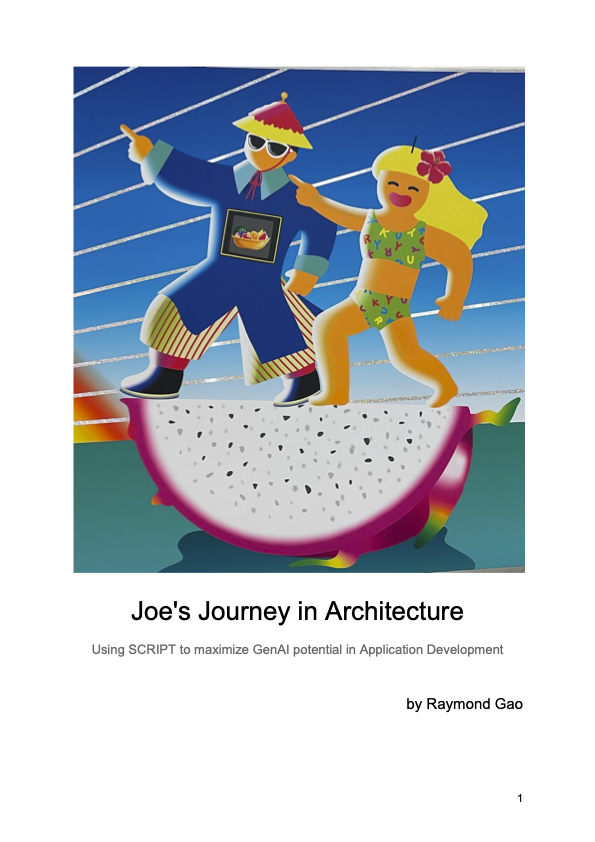
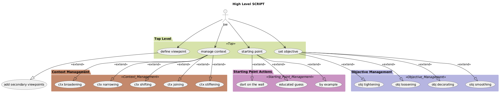
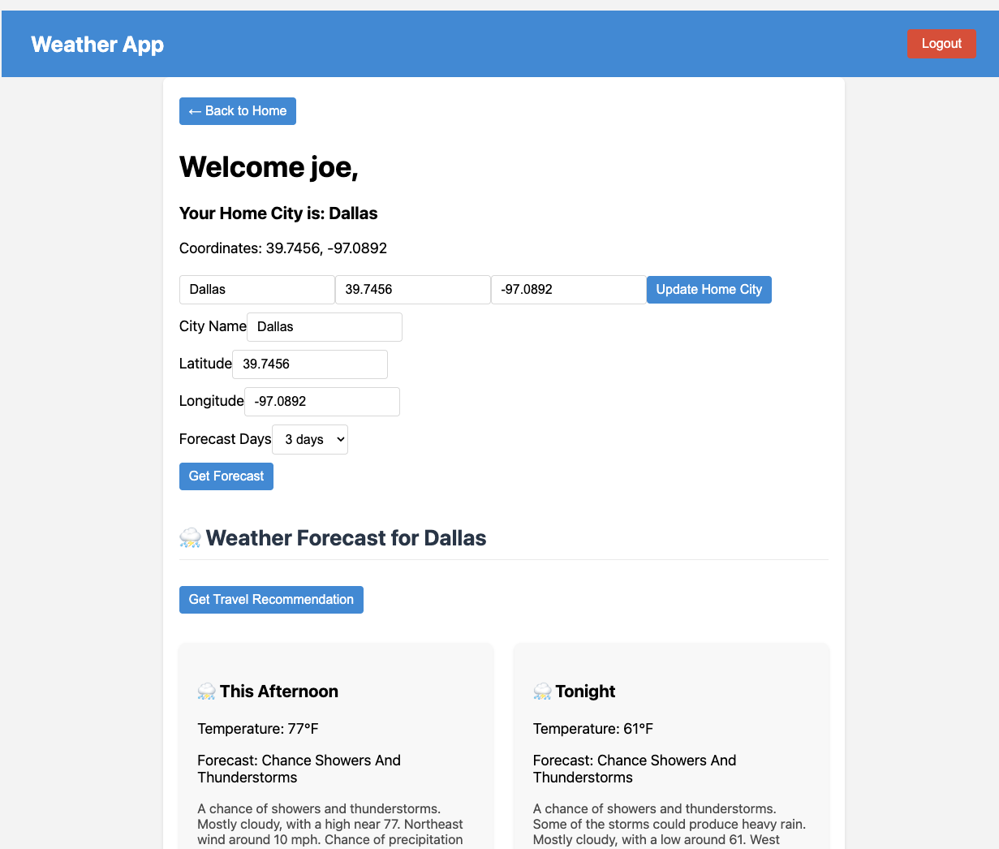
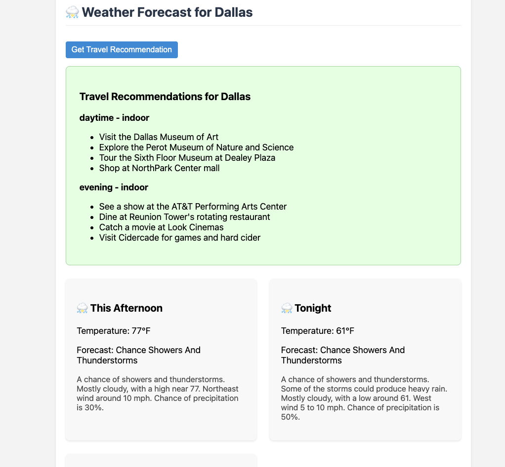

# Companion Code to Joe's Adventure in Architecture
Here you find the source code (companion). 
The book titled - Joe's Adventure in Architecture, Using SCRIPT to maximize GenAI potential in Application Development, is written by Raymond Gao, © 2025.

## [-> Read the Draft Online Now <-](https://online.fliphtml5.com/kznkp/vaog/#p=1)

[Cheat-sheet.pdf](./attachments/cheat-sheet.pdf)

 

## Description
The book talks about using math logic to optimize GenAI for the rapidly application construction. It introduces SCRIPT (Subject Creates Relevant, Impactful and Polished Technology) - a methodology for iterative GenAI prompt engineering. While the technology stack is following, one could use this methodology (language agnostic) with any programming languages.
The underlying technology is:
- NodeJS: ExpressJS & NextJS
- Docker, Helm Chart & Kubernetes

In essense, it discusses, how to reducing (breaking down) long prompts into parts.
- Subject & Viewpoints: your position
  - Primary and Secondary Viewpoints
- Starting Point, where to start
  - Dart on the Wall
  - Educated Guess
  - Doctrine (Exampling)
- Contextual (boundaries) and strategies
  - Context Broadening
  - Context Narrowing
  - Context Joining
  - Context Splitting
  - Context Shifting
  - Context Stiffening
- Objective
  - Objective Tightening
  - Objective Loosening
  - Objective Smoothing
  - Objective Decorating

PDF is provided free of charge. If you like the book and would like to have a paper copy (for the ease of reading and note-taking), you may purchase a book at following dealers.

The source for each chapter is in the correspondingly named folders.

## Images

